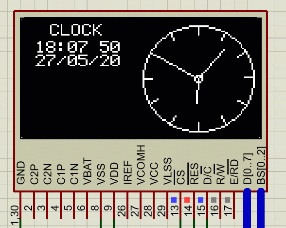

## Analog Clock Based on OLED SSD1306 and PIC18F4550 Micro-controller



### Steps to make an Analog Clock
* Make a small circle with a very small radius such as 1
* Make a big circle with a big radius but make sure to not exceed the screen size.
* **Make Hour Ticks**
  * We have 12 Hours and 360 degrees, which means 1 Hour equals 30 degrees.
  * We will use a for loop incremented by 30 degrees, to draw small lines representing ticks for each hour position. This is done by ```draw_clock_face``` function.
    * ```draw_clock_face``` function uses sine and cosine formulas to draw 12 marks of length 5 at each hour position.
* **Displaying Hour, Minute and Second Hands**
  * Displaying timing using clock hands is very similar to displaying mark.
  * Hour Hand should be very small, while minute being medium and second hand should be longest of all.
  * Data from RTC is read and converted to decimal format from BCD format, and this is data is faced to the ```display_time``` function.
  * Executing this function per second will have an animation effect of moving the second hand of the clock.
  * In the project we have called this per 500ms, the reason for this is the digital clock as we wanted to display the colon blinking, which is done half a second.

[*Click here*](https://embeddedlaboratory.blogspot.com/2020/05/analog-clock-using-oled-and-pic.html) to view the blog.