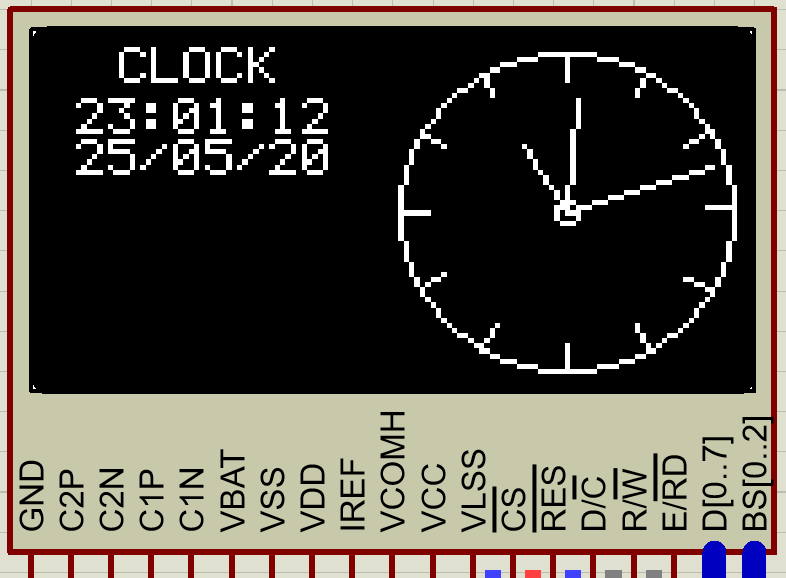

## Analog Clock Based on OLED SSD1306 and PIC18F4550 Micro-controller

### Steps to make an Analog Clock
* Make a small circle of radius 1
* Make a big circle of radius 31
* Make Hour Ticks
  * We have 12 Hours and 360 degrees, which means 1 Hour equals to 30 degrees.
  * We will use a for loop incremented by 30 degrees, to draw ticks for each hour position.
  * Now using sine and cosine formulas we will draw 12 marks of lenth 5 at each hour position.
  * TODO: